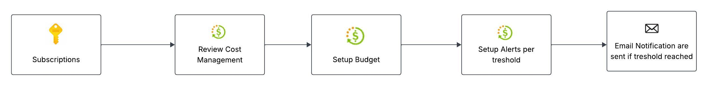
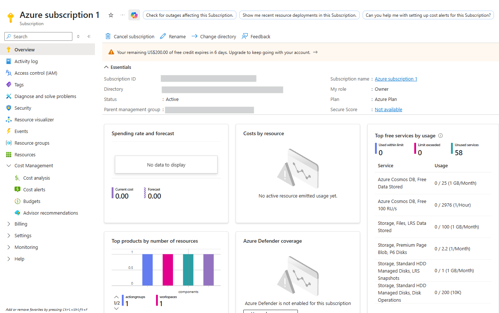
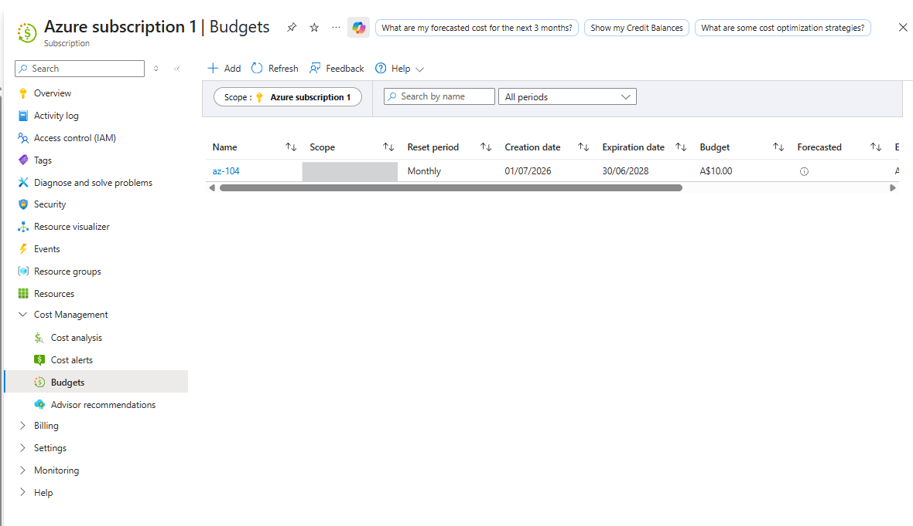
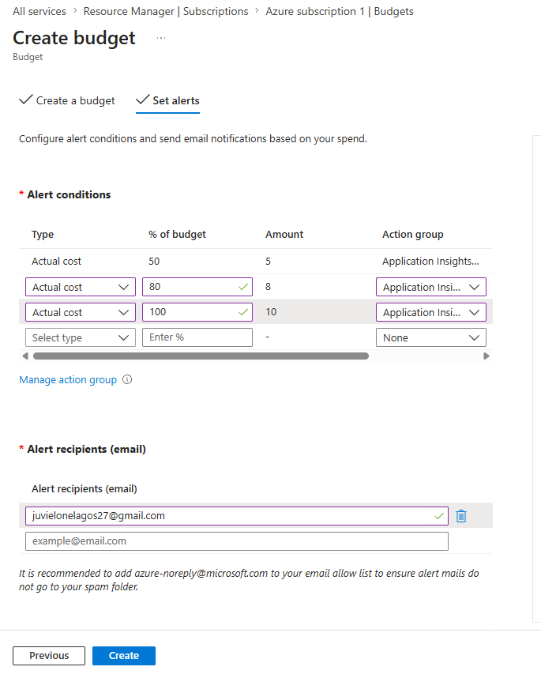
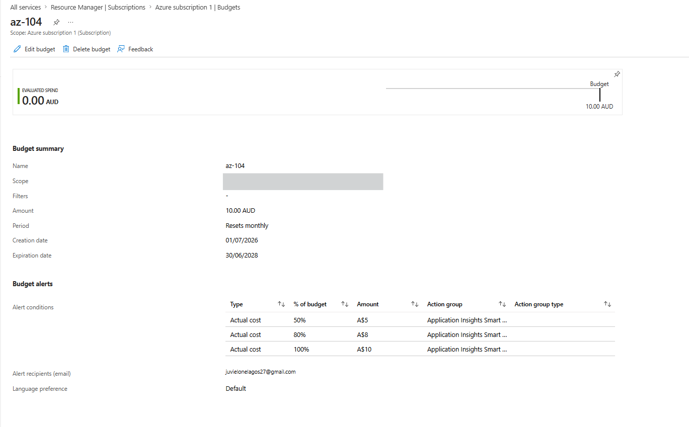

# Lab 01 - Azure Cost Management Budget

## Overview

This lab demonstrates how to configure an Azure subscription budget using Azure Cost Management.

A monthly budget of **USD $10** was created with multiple notification thresholds to help monitor cloud spending during hands-on Azure learning.

The objective of this lab is to understand Azure Cost Management, Budgets, and Cost Alerts while applying cost governance best practices.

---

## Objectives

- Azure Cost Management
- Create a Subscription Budget
- Configure Budget Alert Thresholds
- Receive Email Notifications when spending reaches predefined percentages

---

## Azure Services Used

- Azure Subscription
- Azure Cost Management
- Azure Budgets

---

## Architecture

### Workflow

1. Select the Azure Subscription.
2. Navigate to Azure Cost Management.
3. Create a Monthly Budget.
4. Configure Alert Thresholds.
5. Azure sends Email Notifications when spending reaches the configured threshold.

---

## Budget Configuration

| Setting          | Value              |
| ---------------- | ------------------ |
| Scope            | Azure Subscription |
| Budget Amount    | USD $10            |
| Reset Period     | Monthly            |
| Alert Thresholds | 50%, 80%, 100%     |
| Notification     | Email              |

---

## Implementation

### Step 1

Navigate to **Subscriptions**.

---

### Step 2

Open **Cost Management** and create a new Budget.

---

### Step 3

Configure Budget Alert Thresholds.

- 50%
- 80%
- 100%

Add notification recipients.

---

### Step 4

Create the Budget.

Verify that the Budget appears under Azure Cost Management.

---

## Verification

The budget was successfully created under the Azure Subscription.

Configuration includes:

- Monthly Budget
- Three Alert Thresholds
- Email Notifications

No deployment errors occurred.

---

## Lessons Learned

- Azure Budgets monitor spending against a predefined amount.
- Budget Alerts send notifications when spending reaches configured thresholds.
- Budgets **do not automatically stop resources or spending**.
- Azure Cost Alerts are separate from Budget Alerts and serve different monitoring purposes.
- Budget thresholds can be configured at multiple percentages to improve cost visibility.

---

## Cost Governance

To avoid unnecessary charges:

- Created a monthly budget of USD $10.
- Configured alerts at 50%, 80%, and 100%.
- Budget is used as an early warning mechanism while learning Azure.

---

## Challenges Encountered

The Azure Portal interface differed from older course material.

Instead of relying on the tutorial UI, the latest Azure Cost Management interface was used.

This reinforces the importance of understanding Azure concepts rather than memorizing menu locations.

---

## References

- Microsoft Learn – Azure Cost Management
- Microsoft Learn – Azure Budgets
- AZ-104 Study Labs
